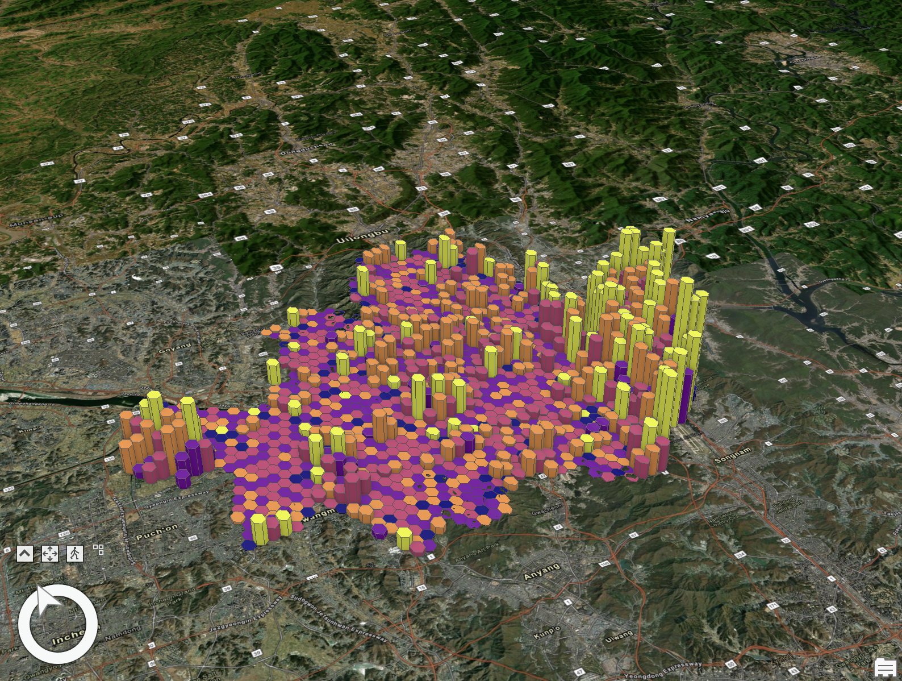
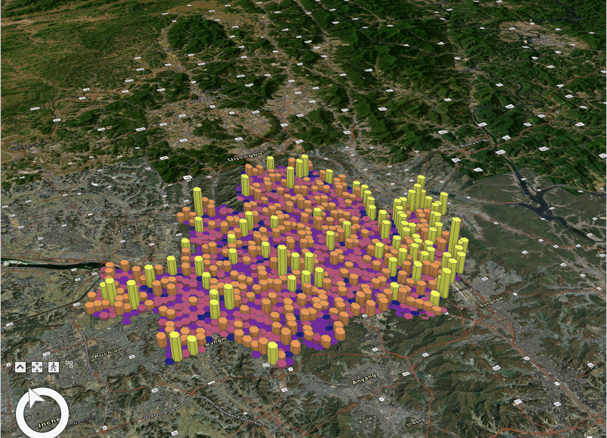
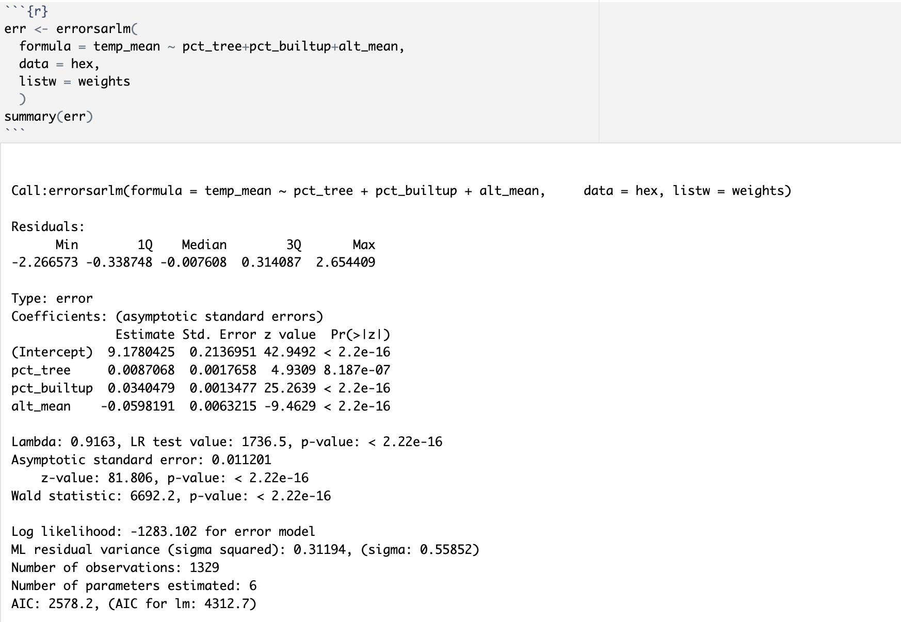

# 0. Background

The Seoul Metropolitan Area is increasingly facing extreme weather events, notably heatwaves and flash flooding. This project's objective is to examine the spatial distribution of land surface temperature and identify any significant statistical patterns. The study also investigates the relationship of tree and built-up area coverage, as well as altitude, with surface temperature patterns.


## 0.1. Hypothesis


1. Built-up areas in Seoul have higher surface temperatures than areas with high tree coverage.
2. Altitude is inversely related to surface temperature in Seoul.


# 1. Data Collection
- Land Surface Temperature(raster): Utilized was Band 10 (Surface Temperature in Celsius) from Multispectral Landsat imagery available on ArcGIS Living Atlas (https://www.arcgis.com/home/item.html?id=d9b466d6a9e647ce8d1dd5fe12eb434b). This Landsat imagery is a collaboration between the U.S. Geological Survey (USGS) and the National Aeronautics and Space Administration (NASA), and is streamlined by ESRI for easier access and visualization.


- Built-up Area and Tree Coverage(raster): I used the European Space Agency WorldCover 2020 Land Cover from ArcGIS Living Atlas(https://tiledimageservices.arcgis.com/P3ePLMYs2RVChkJx/arcgis/rest/services/European_Space_Agency_WorldCover_2020_Land_Cover_220202a/ImageServer).  WorldCover 2020 offers a global land cover map at a 10 m resolution, utilizing Sentinel-1 and 2 data. It includes 11 different land cover classes, with the focus for this study on “10 Tree Cover” and “50 Built-up.”


- Altitude(raster): For the elevation data, I used Terrain raster again from ArcGIS Living Atlas (https://elevation.arcgis.com/arcgis/rest/services/WorldElevation/Terrain/ImageServer). This data provides ground surface heights based on a digital terrain model (DTM), combining multiple data sources. The heights are orthometric (with sea level as 0), and water bodies above sea level are given nominal water heights.


- H3 Hexatiles(vector): H3 hexatiles were generated using "Generate Tessellation" function in ArcGIS Pro. The resolution is 8. 

# 2. Data Processing and Exploratory Data Analysis

## 2.1. Visual Inspection

```{r message=FALSE, warning=FALSE}
library(sf)
library(RColorBrewer)
library(leaflet)
library(dplyr)
library(spdep)
library(spatialreg)
hex <- st_read('hex_seoul.geojson')
```
```{r}
str(hex)

```


```{r}
summary(hex)
```

```{r}
plot(hex)
```
```{r}
plot(hex['trees_sum'])
plot(hex['built_sum'])
plot(hex['temp_mean'])
plot(hex['alt_mean'])


```

```{r}
vars <- list('temp_mean', 'trees_sum', 'built_sum', 'alt_mean')
for (var in vars) {
  hist(hex[[var]],
       xlab = var)
}
```

```{r}
for (var in vars) {
  plot(hex[var], 
     lwd=0.05, 
     border=0)
}
```


## 2.2. Moran's I Test
```{r}
weights <- nb2listw(poly2nb(hex, queen = FALSE), style="W")
temp_moran <- moran.test(hex$temp_mean, weights)
temp_moran
moran.plot(hex$temp_mean, weights)
```
The value of the Moran I statistic is 0.8061464731.It indicates strong positive spatial autocorrelation, meaning that areas with similar values of temp_mean are clustered together geographically. The p-value is < 2.2e-16,  indicating that the observed spatial autocorrelation is highly unlikely to have occurred by chance. This result, the high spatial autocorrelation, was expectecd because many environmental variables, such as temperature, precipitation, and humidity, should have geographically defined underlying climatic processes. For example, areas close to each other are likely to experience similar weather patterns, which leads to similar temperatures. Furthermore, given that the scope of this project, Seoul is an urbanized area, urban heat island effect may be playing role in the clustering of higher temperatures. This occurs because urban materials (like concrete and asphalt) absorb and re-radiate more heat compared to natural landscapes. 

Then, let's try testing with other variables as well. 


```{r}
trees_moran <- moran.test(hex$trees_sum, weights)
trees_moran
moran.plot(hex$trees_sum, weights)
```


```{r}
builtup_moran <- moran.test(hex$built_sum, weights)
builtup_moran
moran.plot(hex$built_sum, weights)
```


```{r}
alt_moran <- moran.test(hex$alt_mean, weights)
alt_moran
moran.plot(hex$alt_mean, weights)
```
The tests suggest there are statistically significant spatial patterns across the variables. Then the question would be "How do the spatial patterns interplay with each other?". We will start from linear regression model which does not account for spatial dependency of the variables. 

# 3. Linear Regression Model


```{r}
ols <- lm(
  formula = temp_mean ~ trees_sum+built_sum+alt_mean, 
  data = hex
  )
summary(ols)
```

I will try engineer the features, so that we obtain a better regression model.

```{r}
hex$trees_count[hex$trees_count == 0] <- NA
hex$built_count[hex$built_count == 0] <- NA
hex$pct_tree <- (hex$trees_sum / hex$trees_count) * 100
hex$pct_builtup <- (hex$built_sum / hex$built_count) * 100
str(hex)
```
```{r}

plot(hex,max.plot = 16)

```


```{r}
ols_eng <- lm(
  formula = temp_mean ~ pct_tree+pct_builtup+alt_mean, 
  data = hex
  )
summary(ols_eng)
```


When we compare the resuls of the models before and after feature engineering, both models show that trees_sum and built_sum and their engineered counterparts pct_tree and pct_builtup have positive effects on temp_mean, while alt_mean has a negative effect. But we can see that the coefficent values for pct_tree and pct_builtup are higher than their counterparts. This suggests that percentage changes in tree coverage and built-up areas have a more pronounced effect on temperature, compared to the absolute changes (sums). As for "alt_mean", the magnitude and direction of the coefficients are almost identical in both models, which suggests that altitude's influence on temperature is consistent regardless of how tree and built-up area variables are represented (whether in relative or absolute term). Back to the trees and built-up area, we will use the relative term(coverage) for statistical models. The difference between the absolute and relative would have been greater if we used statistical boundaries rather than the hexatiles. 

# 4. Understanding Residuals

## 4.1. Visual Inspection

```{r}
hex$ols_resid <- residuals(ols_eng)
plot(hex['ols_resid'], 
     lwd=0.05, 
     border=0
     )
```

We can clearly see the clustering patterns among the error terms. This indicates that the residuals from the OLS model are not randomly distributed but are instead correlated based on their location.If certain areas consistently show positive or negative residuals, it might indicate that the model is systematically over or underestimating the dependent variable in those areas. Meaning, the linear regression model is missing explanatory variables that have a spatial dimension, or non-linear relationships that aren't captured by the model.


## 4.2. Moran's test

```{r}
weights <- nb2listw(poly2nb(hex, queen = FALSE), style="W")
moran.test(hex$ols_resid, weights)
moran.plot(hex$ols_resid, weights)
```
Even the Moran's I value indicates that there is a systematic pattern to the residuals, which suggests that the OLS model has not captured all the spatial processes influencing the our dependent variable (temperature). 

Now that the spatial patterns are evident, we should consider spatial regression techniques such as spatial lag and spatial error model. 

## 4.3. Spatial lag model

```{r}
lag <- lagsarlm(
  formula = temp_mean ~ pct_tree+pct_builtup+alt_mean, 
  data = hex, 
  listw = weights
  )
summary(lag)
```
Here, we have a spatial lag model, which includes a spatially lagged dependent variable as an additional predictor. This is indicated by the presence of the Rho parameter. Rho (0.77955), close to 1, suggests a strong spatial autocorrelation. The associated p-value (< 2.22e-16) indicates that this spatial component is statistically significant. 


```{r}
impacts(lag, listw=weights)
```

With the impact measure, we can directly interpret the impact of each independent varable on the response variable. 

- pct_tree:
-- Direct Impact: A one-percentage point **increase** in tree coverage is associated with an increase in mean temperature of approximately 0.011 degrees(Celsius) in the same area.
-- Indirect Impact: That same one-percentage point increase in tree coverage also **increases** the mean temperature by approximately 0.031 degrees in neighboring areas.
-- Total Impact: The combined (total) effect of a one-percentage point increase in tree coverage on mean temperature, considering both the local area and neighboring areas, is approximately 0.042 degrees.

- pct_builtup:
--Direct Impact: A one-percentage point **increase** in the built-up area is associated with an increase in mean temperature of approximately 0.024 degrees in the same area.
-- Indirect Impact: Additionally, it **increases** mean temperature by approximately 0.064 degrees in neighboring areas.
Total Impact: The overall effect of a one-percentage point increase in built-up area on mean temperature is approximately 0.088 degrees.

- alt_mean:

--Direct Impact: A unit increase in mean altitude is associated with a **decrease** in mean temperature of approximately 0.073 degrees in the same area.
--Indirect Impact: It also **decreases** mean temperature by approximately 0.199 degrees in neighboring areas.
--Total Impact: The combined effect of a unit increase in mean altitude on mean temperature, across the local and neighboring areas, is a decrease of approximately 0.272 degrees.


```{r}
hex$lag_resid <- residuals(lag)
plot(hex['lag_resid'], 
     lwd=0.05, 
     border=0
     )
```

Compared to the linear regression model, we see the values for this model are less clustered, more dispersed. However, to make sure, we will run Moran's I test on the residuals.


```{r}
moran.test(hex$lag_resid, weights)
moran.plot(hex$lag_resid, weights)
```
The Moran's I test for the residuals of the spatial lag model still shows some positive spatial autocorrelation. This suggests that while the spatial lag model has accounted for some of the spatial dependence in the data (as reflected in the lower Moran's I value compared to the original OLS model), there may still be spatial patterns in the residuals that are not fully explained by the model. This suggests that we try different a spatial regression model: spatial error model. 


## 4.4. Spatial error model
In a spatial error model, we assume that our errors (our residuals) are dependent on lagged error terms. In practice, this generally means that we're assuming that spatial auto-correlation is due to a variable we have not accounted for.

```{r}
err <- errorsarlm(
  formula = temp_mean ~ pct_tree+pct_builtup+alt_mean, 
  data = hex, 
  listw = weights
  )
summary(err)
```
The spatial error model provides evidence that accounting for spatial autocorrelation in the error terms is important for modeling mean temperature. The estimate of 0.9163 for Lambda suggests a strong spatial autocorrelation in the error terms.


```{r}
hex$err_resid <- residuals(err)
plot(hex['err_resid'], 
     lwd=0.05, 
     border=0
     )
```
```{r}
moran.test(hex$err_resid, weights)
moran.plot(hex$err_resid, weights)
```
The result of the Moran's I test suggests that after accounting for spatial autocorrelation through the spatial error model, there is no significant remaining spatial autocorrelation in the residuals. This indicates that the spatial error model has been successful in capturing the spatial structure of the data that was previously evident in the residuals of the non-spatial and spatial lag models.

Given that the Moran's I statistic is negative but close to zero, and the p-value is high, the spatial error model is appropriate for the data and that the inclusion of the error term has adequately accounted for the spatial dependency among observations.


# 5. Which Model to Choose?

Telling from the Moran's I statistics, we can say that the spatial error model is more suitable. Nonetheless, I will use Akaike Information Criterion (AIC), Lagrange Multipliers, and Log-Likelihood values to assess the models.

## 5.1. Akaike Information Criterion
```{r}
AIC(ols_eng, err, lag)
```

Based on the AIC values, the err model is the preferred model as it has the lowest AIC score, indicating it likely is the best model among the three for explaining the variation in the temperature data. The lag model, while an improvement over the ols_eng model, is not as strong as the err model according to the AIC metric.

## 5.2. Log-Likelihood Values
```{r}
anova(err, lag)
```
As demostrated from the previous AIC test, the spatial error model (err) has a significantly lower AIC (2578.2) compared to the spatial lag model (lag), which has an AIC of 2878.0. A reason to select the error model over the lag model.
The log-likelihood values also support this conclusion, with the spatial error model having a higher log-likelihood, indicating a better fit.


## 5.3. Lagrange Multipliers
```{r}
lagrange <- lm.LMtests(ols_eng, weights, test='all')
lagrange
```

All the tests indicate statistially significant spatial dependence. Both LM and robust LM tests for error and lag suggest that spatial effects are present. Under this test, we cannot safely say that the error model is more appropriate than teh lag model. However, AIC and Log-likelyhood values suggest that the spatial error model better explains the spatial relations in the data. 


# 6. Discussion
Let's revisit the hypothesis:

1. Built-up areas in Seoul have higher surface temperatures than areas with high tree coverage.
2. Altitude is inversely related to surface temperature in Seoul.


Through the statistical analysis, we now know that we can adopt the hypothesis over the null hypothesis.

It is counterintuitive though, that the coefficients of pct_tree are consistently positive across the models. Shouldn't an increase in tree coverage (pct_tree) be associated with an increase in temperature, as trees are generally thought to cool the environment through shading and evaporation? The positive association may be due to pct_tree being not independent from pct_built. It is worth a further investigation. 


# 7. Demystification Guide


## 7.1. Illustration

The spatial distribution of residuls in the linear regression model.

The spatial distribution of residuls in the spatial error model.


See how effectively SEM addresses spatial dependence variables and thus leaving independent residuals.




## 7.2. Description
The Spatial Error Model addresses the issue of spatial autocorrelation in error terms of regression models. This development was crucial because spatial autocorrelation violates the assumption of independent errors in classical regression analysis (refer to the results of OLS in this document), leading to biased and inefficient estimates. The introduction of spatial error models provided a way to account for these spatial dependencies, and imporved the accuracy and reliability of statistical analyses involving spatial data. 

By revisiting the SEM used in this exercise, one may grasp a better understanding of the model. Let's start from the coefficient values:

- Intercept (9.1780425): Think of it as the baseline temperature in Seoul when the percentage of trees, built-up area, and altitude are all at zero. It's a starting point for our temperature predictions.
- Percentage of Tree Coverage (pct_tree, 0.0087068): For each 1% increase in tree coverage, the average surface temperature increases by about 0.009 degrees. This might seem surprising, as we usually expect trees to cool the area.
- Percentage of Built-up Area (pct_builtup, 0.0340479): Each 1% increase in built-up areas (like buildings and roads) raises the average surface temperature by approximately 0.034 degrees. This aligns with the urban heat island effect, where urban materials absorb and re-radiate heat.
- Altitude (alt_mean, -0.0598191): As we go higher, the temperature tends to drop. Specifically, for each unit increase in altitude, the average temperature decreases by about 0.060 degrees.
 
Then we have another statistics that is unique to the SEM, a Lambda. This model shows Lambda value of 0.9163.The number tells us how much the error in one area's temperature is influenced by the errors in nearby areas. A value close to 1 suggests a strong influence, indicating that temperatures in one part of Seoul can affect temperatures in adjacent parts. Since we got a value that is almost 1, it is worth considering introducing a new variable(s) other than pct_tree, pct_builtup, and alt_mean. By doing so, we could capture spatial effects as in variables rather than the error term.

Then, there are p-value and z-score. A p-value (like those seen for intercept, pct_tree, pct_builtup, and alt_mean) tells us whether our findings are likely to be a fluke. A very low p-value (< 2.2e-16) means it's highly unlikely our results are just by chance. Z-value (like 42.9492 for the intercept) measures how many standard deviations a coefficient is from zero. A high absolute z-value usually goes hand-in-hand with a low p-value, indicating a strong relationship.

Finally, we have model evaluation metrics. AIC (2578.2) helps us compare different models. Lower AIC values indicate a better model. Comparing the values of AIC of models help us to choose a proper one among them.On the other hand, Log Likelihood (-1283.102) is a measure of how well our model fits the data. The higher this number, the better the fit. This value also should be compared among other values. 


